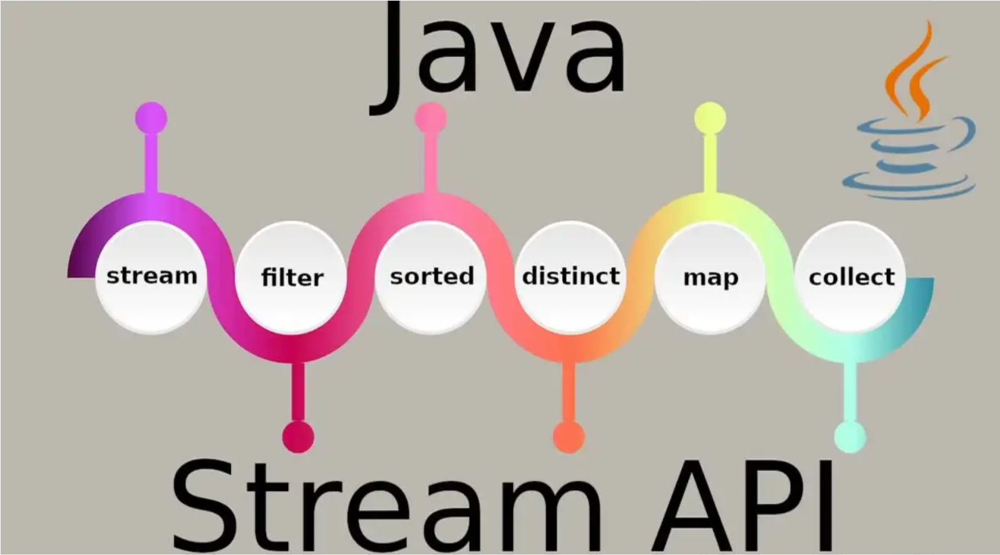

# Java Stream API EXAMPLES



## Description
<ul style="list-style-type:disc">
  <li>There are some examples of Java Stream API which I've done </li>
  <li>All these examples are implemented java stream features</li>
</ul>

### Description of the Methods
<table style="width:100%">
  <tr>
    <th>Folder</th>
    <th>Description</th>
  </tr>
  <tr>
      <td>arraynumberexample</td>
      <td>Sample Implementation of java stream features containing map, reduce , limit, sorted, max, min, Comparator.comparing, filter, Collections.frequency, average, orElse, mapToInt</td>
  </tr>
  <tr>
      <td>banktransactionexample</td>
      <td>This is a bank transaction example implemented by java stream including in Comparator, Comparator.comparing, filter, count, max, min/td>
  </tr>
  <tr>
      <td>employeedata</td>
      <td>Employee data is used for FilterConsumerPredicateExample located under funcationalexamples</td>
  </tr>
  <tr>
      <td>employeeexample</td>
      <td>Well defined example of the usage of java stream features comprised of Collectors.groupingBy, Collectors.counting, Collectors.groupingBy, Collectors.maxBy, Comparator.comparingDouble, sorted, reversed, max, Comparator.comparingInt, Collectors.partitioningBy, Collectors.summarizingDouble, filter, min, Collectors.averagingDouble, map, Collectors.averagingInt </td>
  </tr>
  <tr>
      <td>footballeagueexample</td>
      <td>This is the football league example with the usage of Comparator provided by Java stream featues</td>
  </tr>
  <tr>
      <td>footballteambyleagueandteamtype</td>
      <td>Well defined example of the usage of java stream features with the usage of Collectors.groupingBy, Collectors.summingInt, Collectors.summarizingInt, Collectors.counting, Collectors.partitioningBy, Collectors.joining, Collectors.mapping, computeIfAbsent</td>
  </tr>
  <tr>
      <td>functionalexamples</td>
      <td>Simple example of the usage of java stream features with showing how to use noneMatch, anyMatch, allMatch, compareTo, BiConsumer, accept, Consumer, distinct, filter, sorted, Comparator, reversed, thenComparing, flatMap</td>
  </tr>
  <tr>
      <td>movieexample</td>
      <td>Well-defined implementation of java stream features involving in  filter, flatMap, Collectors.groupingBy, Collectors.counting, Collectors.mapping, count, Comparator, max, min, mapToLong , sum, sorted, findFirst, anyMatch, distinct, forEach, computeIfAbsent, Predicate, negate</td>
  </tr>
  <tr>
      <td>studentdata</td>
      <td>Employee data is used for ConsumerExample located under funcationalexamples</td>
  </tr>
</table>


### Usage of Technology
* Java 15

### 🔨 Run the App

<b>1 )</b> Clone project from github
```
    File 
      -> New 
         -> Project from Version Control
           -> Paste the git url and Click Clone
```
<b>2 )</b> Click "Run"